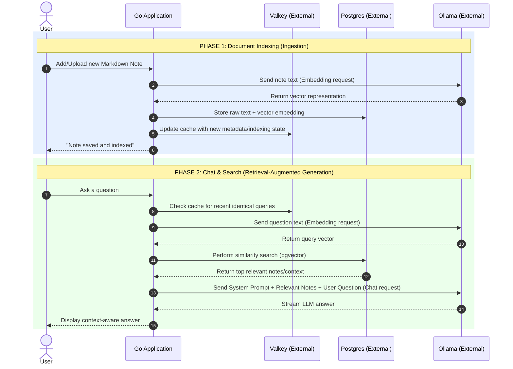

# AI Knowledgebase

A lightweight, personal AI-powered knowledgebase hacked on a weekend.
This project allows you to index local documents or notes and query them using an LLM and text embeddings for relevant context retrieval.

## Disclaimer:
I built it mainly based on my personal needs and desires, and I am running it on my
Kubernetes Environment with some tooling already in place (cnpg, valkey, you name it..).
Docs are coming, mainly focused on kubernetes and maybe docker-compose for local usages.

## 🚀 Features

* **Document Indexing:** Easily parse and ingest markdown notes.
* **Vector Embeddings:** Automatically converts your knowledge into searchable vector embeddings.
* **AI Chat/Search:** Ask questions in plain English and get context-aware answers directly from your documents.
* **Lightweight & Fast:** Minimal setup designed for localized, personal use.

## 🛠️ Tech Stack

* **Language:** Go - well, and HTML.
* **LLM / Embeddings Backend:** Currently only: Ollama (e.g., `granite4.1` or `llama3`)
* **Vector Store:** Currently PSQL and Valkey

